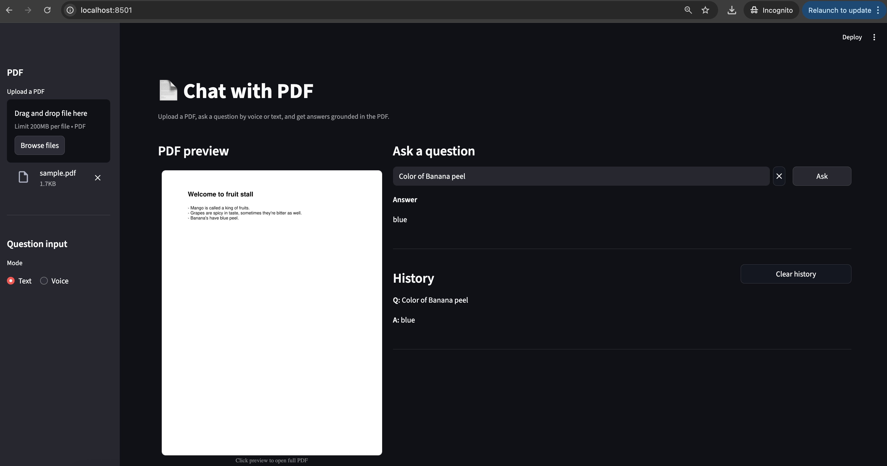

## Chat with PDF

Ask questions about any PDF using retrieval-augmented generation (RAG). Upload a PDF, query by text or voice, and get grounded answers. Built with Streamlit and a lightweight local QA pipeline.

### Features
- Text and voice question modes (Whisper for transcription)
- Side-by-side PDF preview with click-to-open full document
- Retrieval-augmented answers using sentence embeddings + nearest neighbors
- Clean UI: Ask button, in-input clear (✕), and per-PDF Q/A history
- History auto-clears when you upload a new PDF

### Preview


Attachment: [Demo video (mp4)](pdf-chatter.mp4)

### Demo (local)
```bash
python -m venv .venv && source .venv/bin/activate
python -m pip install --upgrade pip
pip install -r requirements.txt
streamlit run app.py
```

Then open the Streamlit URL shown in the terminal.

### Requirements
- Python 3.10+
- macOS/Linux/Windows
- Microphone access for voice mode

### Optional dependencies
- PyMuPDF (`pymupdf`) for inline PDF page previews

Install optional preview support:
```bash
pip install pymupdf
```

### How it works
1. Extract text per page from the uploaded PDF and chunk it.
2. Encode chunks with a sentence embedding model and build a nearest-neighbor index.
3. On each query, retrieve top chunks; run a QA model on the concatenated context.
4. Display the final answer; maintain a simple Q/A history per PDF.

### Usage
1. Upload a PDF from the sidebar.
2. Choose Mode: Text or Voice.
   - Text: type a question, optional ✕ button clears input; click Ask.
   - Voice: click Ask to record, edit the transcript if desired, ✕ clears it; click Ask to answer.
3. Answers appear under the input; history shows below once you have at least one Q/A. Use Clear history to reset.

### Troubleshooting
- ReportLab missing when running sample script: ensure you installed packages inside the active venv.
  ```bash
  source .venv/bin/activate
  python -m pip install reportlab
  ```
- Whisper/ffmpeg issues: this app records raw audio and feeds it directly to Whisper (no ffmpeg required). Ensure your microphone permissions are allowed for the terminal.
- PDF preview blocked in Chrome: preview thumbnails are shown; clicking them opens the full PDF via a Blob URL. If the tab is blank, disable aggressive popup blocking and try again.

### Dev scripts
Generate a sample PDF for testing:
```bash
python scripts/make_sample_pdf.py
```

### Project layout
```
app.py                  # Streamlit UI and orchestration
main.py                 # Simple Whisper CLI demo (record + transcribe)
transcription.py        # Recording and transcription helpers
pdf_qa/                 # RAG pipeline
  ingest.py             # PDF text extraction and chunking
  retriever.py          # Embedding + nearest neighbors retrieval
  qa.py                 # QA pipeline and answer assembly
scripts/make_sample_pdf.py
```

### Notes
- Models load lazily on first use to keep app startup fast.
- When you upload a different PDF, the index rebuilds and history resets.

### License
MIT

